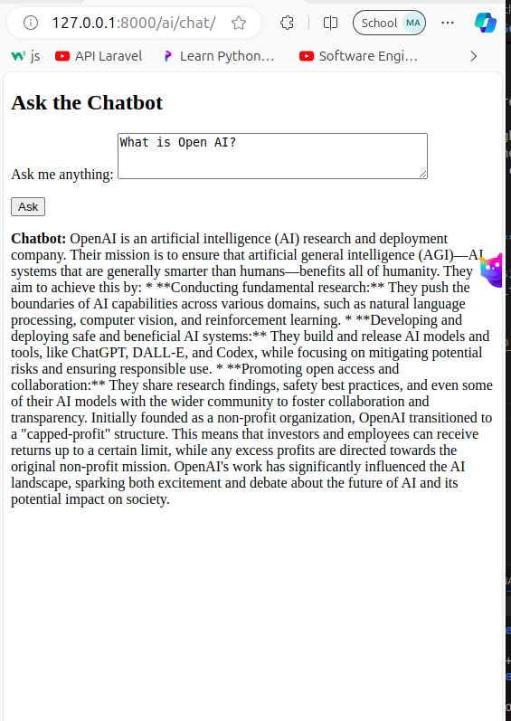

# Chatbot Project with Google Gemini AI

This project is a chatbot application that utilizes the **Google Gemini AI** API to generate responses based on user input. The chatbot can be used for various purposes, such as customer support, FAQs, or any other conversational use case.

---

## **Table of Contents**
- [Prerequisites](#prerequisites)
- [Setup Instructions](#setup-instructions)
- [Running the Project](#running-the-project)
- [Project Structure](#project-structure)
- [Configuration](#configuration)
- [Troubleshooting](#troubleshooting)

---

## **Prerequisites**

Before setting up the project, make sure you have the following installed on your machine:

- **Python 3.12** or higher
- **Django** 5.1 or higher
- **Google Gemini API** credentials (API Key)

---

## **Setup Instructions**

### 1. **Clone the Repository**
Clone the project repository to your local machine.

```bash
git clone https://github.com/your-username/Chatbot_LLM.git


